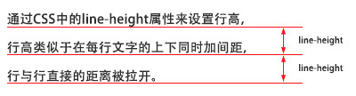

# CSS样式

## css基本语法

css的定义方法是：

选择器 { 属性:值; 属性:值; 属性:值;}

选择器是将样式和页面元素关联起来的名称，属性是希望设置的样式属性每个属性有一个或多个值。代码示例：

```css
/*
    css注释 ctrl+shift+"/"
*/

div{ 
    width:100px; 
    height:100px; 
    color:red 
}
```


## css页面引入方法：

1、外联式：通过link标签，链接到外部样式表到页面中。

```html
<link rel="stylesheet" type="text/css" href="css/main.css">
```

2、嵌入式：通过style标签，在网页上创建嵌入的样式表。

```html
<style type="text/css">
    div{ width:100px; height:100px; color:red }
    ......
</style>
```

3、内联式：通过标签的style属性，在标签上直接写样式。

```html
<div style="width:100px; height:100px; color:red ">......</div>
```


## css文本设置

常用的应用文本的css样式：

- color 设置文字的颜色，如： color:red;
- font-size 设置文字的大小，如：font-size:12px;
- font-family 设置文字的字体，如：font-family:'微软雅黑';
- font-style 设置字体是否倾斜，如：font-style:'normal'; 设置不倾斜，font-style:italic;设置文字倾斜
- font-weight 设置文字是否加粗，如：font-weight:bold; 设置加粗 font-weight:normal 设置不加粗
- line-height 设置文字的行高，设置行高相当于在每行文字的上下同时加间距， 如：line-height:24px; 

- font 同时设置文字的几个属性，写的顺序有兼容问题，建议按照如下顺序写： font：**是否加粗 字号/行高 字体**；如： font:normal 12px/36px '微软雅黑';
- text-decoration 设置文字的下划线，如：text-decoration:none; 将文字下划线去掉
- text-indent 设置文字首行缩进，如：text-indent:24px; 设置文字首行缩进24px
   
- text-align 设置文字水平对齐方式，如text-align:center 设置文字水平居中


## css颜色表示法

css颜色值主要有三种表示方法：

1、颜色名表示，比如：red 红色，gold 金色

2、rgb表示，比如：rgb(255,0,0)表示红色

3、16进制数值表示，比如：#ff0000 表示红色，这种可以简写成 #f00


# css选择器

常用的选择器有如下几种：

## 1、标签选择器

标签选择器，此种选择器影响范围大，建议尽量应用在层级选择器中。
举例：

```html
*{margin:0;padding:0} <!-- 选择所有的标签 -->
div{color:red}   


<div>....</div>   <!-- 对应以上两条样式 -->
<div class="box">....</div>   <!-- 对应以上两条样式 -->
```

## 2、id选择器(#)

通过id名来选择元素，元素的id名称不能重复，所以一个样式设置项只能对应于页面上一个元素，不能复用，id名一般给程序使用，所以不推荐使用id作为选择器。
举例：

```html
#box{color:red} 

<div id="box">....</div>   <!-- 对应以上一条样式，其它元素不允许应用此样式 -->
```

## 3、类选择器(.)

通过类名来选择元素，一个类可应用于多个元素，一个元素上也可以使用多个类，应用灵活，可复用，是css中应用最多的一种选择器。
举例：

```html
.red{color:red}
.big{font-size:20px}
.mt10{margin-top:10px} 

<div class="red">....</div>
<h1 class="red big mt10">....</h1>
<p class="red mt10">....</p>
```

## 4、层级选择器

主要应用在选择父元素下的子元素，或者子元素下面的子元素，可与标签元素结合使用，减少命名，同时也可以通过层级，防止命名冲突。
举例：

```html
.box span{color:red}
.box .red{color:pink}
.red{color:red}

<div class="box">
    <span>....</span>
    <a href="#" class="red">....</a>
</div>

<h3 class="red">....</h3>
```

## 5、组选择器

多个选择器，如果有同样的样式设置，可以使用组选择器。
举例：

```html
.box1,.box2,.box3{width:100px;height:100px}
.box1{background:red}
.box2{background:pink}
.box2{background:gold}

<div class="box1">....</div>
<div class="box2">....</div>
<div class="box3">....</div>
```

## 6、伪类及伪元素选择器

常用的**伪类选择器**有hover，表示鼠标悬浮在元素上时的状态，**伪元素选择器**有before和after,它们可以通过样式在元素中插入内容。

```html
.box1:hover{color:red}
.box2:before{content:'行首文字';}
.box3:after{content:'行尾文字';}


<div class="box1">....</div>
<div class="box2">....</div>
<div class="box3">....</div>
```