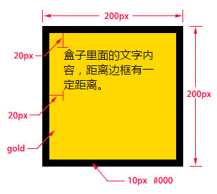
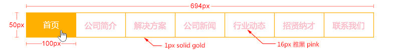

## CSS盒子模型

**盒子模型解释**
元素在页面中显示成一个方块，类似一个盒子，CSS盒子模型就是使用现实中盒子来做比喻，帮助我们设置元素对应的样式。盒子模型示意图如下：


把元素叫做盒子，设置对应的样式分别为：盒子的宽度(width)、盒子的高度(height)、盒子的边框(border)、盒子内的内容和边框之间的间距(padding)、盒子与盒子之间的间距(margin)。

**设置宽高**

```
width:200px;  /* 设置盒子的宽度，此宽度是指盒子内容的宽度，不是盒子整体宽度(难点) */ 
height:200px; /* 设置盒子的高度，此高度是指盒子内容的高度，不是盒子整体高度(难点) */
```

**设置边框**
设置一边的边框，比如顶部边框，可以按如下设置：

```
border-top-color:red;    /* 设置顶部边框颜色为红色 */  
border-top-width:10px;   /* 设置顶部边框粗细为10px */   
border-top-style:solid;  /* 设置顶部边框的线性为实线，常用的有：solid(实线)  dashed(虚线)  dotted(点线); */
```

上面三句可以简写成一句：

```
border-top:10px solid red;
```

设置其它三个边的方法和上面一样，把上面的'top'换成'left'就是设置左边，换成'right'就是设置右边，换成'bottom'就是设置底边。

四个边如果设置一样，可以将四个边的设置合并成一句：

```
border:10px solid red;
```

**设置内间距padding**

设置盒子四边的内间距，可设置如下：

```
padding-top：20px;     /* 设置顶部内间距20px */ 
padding-left:30px;     /* 设置左边内间距30px */ 
padding-right:40px;    /* 设置右边内间距40px */ 
padding-bottom:50px;   /* 设置底部内间距50px */
```

上面的设置可以简写如下：

```
padding：20px 40px 50px 30px; /* 四个值按照顺时针方向，分别设置的是 上 右 下 左  
四个方向的内边距值。 */
```

padding后面还可以跟3个值，2个值和1个值，它们分别设置的项目如下：

```
padding：20px 40px 50px; /* 设置顶部内边距为20px，左右内边距为40px，底部内边距为50px */ 
padding：20px 40px; /* 设置上下内边距为20px，左右内边距为40px*/ 
padding：20px; /* 设置四边内边距为20px */
```

**设置外间距margin**

外边距的设置方法和padding的设置方法相同，将上面设置项中的'padding'换成'margin'就是外边距设置方法。

**理解练习**
通过盒子模型的原理，制作下面的盒子：



盒子的width和height设置的是盒子内容的宽和高，不是盒子本身的宽和高，盒子的真实尺寸计算公式如下：

- 盒子宽度 = width + padding左右 + border左右
- 盒子高度 = height + padding上下 + border上下


## 盒模型使用技巧及相关问题

### **margin相关技巧**

1、设置元素水平居中： margin:x auto;
2、margin负值让元素位移及边框合并

### **外边距合并**

外边距合并指的是，当两个垂直外边距相遇时，它们将形成一个外边距。合并后的外边距的高度等于两个发生合并的外边距的高度中的**较大者**。解决方法如下：

1、使用这种特性
2、设置一边的外边距，一般设置margin-top
3、将元素浮动或者定位


### **margin-top 塌陷**

在**两个盒子嵌套**时候，内部的盒子设置的margin-top会加到外边的盒子上，导致内部的盒子margin-top设置失败，解决方法如下：

1、外部盒子设置一个边框
2、外部盒子设置 overflow:hidden
3、使用伪元素类：


## css元素溢出

当子元素的尺寸超过父元素的尺寸时，需要设置父元素显示溢出的子元素的方式，设置的方法是通过overflow属性来设置。

**overflow的设置项：**
1、visible 默认值。内容不会被修剪，会呈现在元素框之外。
2、hidden 内容会被修剪，并且其余内容是不可见的，此属性还有**清除浮动、清除margin-top塌陷**的功能。
3、scroll 内容会被修剪，但是浏览器会显示滚动条以便查看其余的内容。
4、auto 如果内容被修剪，则浏览器会显示滚动条以便查看其余的内容。
5、inherit 规定应该从父元素继承 overflow 属性的值。

元素溢出示例：


## 块元素、内联元素、内联块元素

元素就是标签，布局中常用的有三种标签，块元素、内联元素、内联块元素，了解这三种元素的特性，才能熟练的进行页面布局。

### **块元素**

块元素，也可以称为行元素，布局中常用的标签如：div、p、ul、li、h1~h6、dl、dt、dd等等都是块元素，它在布局中的行为：

- 支持全部的样式
- **如果没有设置宽度，默认的宽度为父级宽度100%**
- 盒子占据一行、即使设置了宽度

### **内联元素**

内联元素，也可以称为行内元素，布局中常用的标签如：a、span、em、b、strong、i等等都是内联元素，它们在布局中的行为：

- 支持部分样式（**不支持宽、高、margin上下、padding上下**）
- 宽高由内容决定
- 盒子并在一行
- 代码换行，盒子之间会产生间距
- 子元素是内联元素，父元素可以用text-align属性设置子元素水平对齐方式

**解决内联元素间隙的方法**
1、去掉内联元素之间的换行
2、将内联元素的父级设置font-size为0，内联元素自身再设置font-size

### **内联块元素**

内联块元素，也叫行内块元素，是新增的元素类型，现有元素没有归于此类别的，img和input元素的行为类似这种元素，但是也归类于内联元素，我们可以用display属性将块元素或者内联元素转化成这种元素。它们在布局中表现的行为：

- 支持全部样式
- 如果没有设置宽高，宽高由内容决定
- 盒子并在一行
- 代码换行，盒子会产生间距
- 子元素是内联块元素，父元素可以用text-align属性设置子元素水平对齐方式。

这三种元素，可以通过display属性来相互转化，不过实际开发中，块元素用得比较多，所以我们经常把内联元素转化为块元素，少量转化为内联块，而要使用内联元素时，直接使用内联元素，而不用块元素转化了。

#### **display属性**

display属性是用来设置元素的类型及隐藏的，常用的属性有：
1、none 元素隐藏且不占位置
2、block 元素以块元素显示
3、inline 元素以内联元素显示
4、inline-block 元素以内联块元素显示

**课堂练习**
请制作图中所示的菜单：
