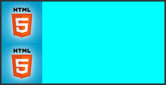
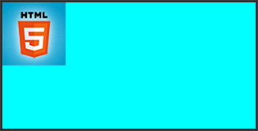
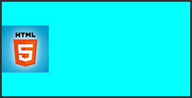
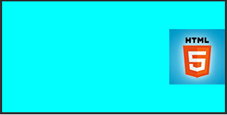
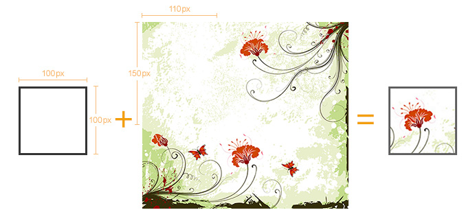
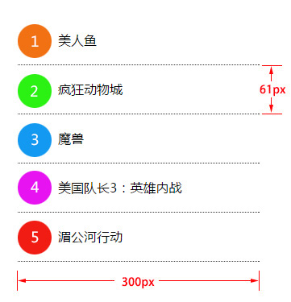

## background属性

**属性解释**
background属性是css中应用比较多，且比较重要的一个属性，它是负责给盒子设置背景图片和背景颜色的，background是一个复合属性，它可以分解成如下几个设置项：

- background-color 设置背景颜色
- background-image 设置背景图片地址
              background-image:url()
- background-repeat 设置背景图片如何重复平铺
              默认全部重复平铺
  			repeat-x x轴重复平铺 
  			repeat-y y轴重复平铺
  			no-repeat 不重复平铺
- background-position 设置背景图片的位置
              top center
  			left center等等
- background-attachment 设置背景图片是固定还是随着页面滚动条滚动

实际应用中，我们可以用background属性将上面所有的设置项放在一起，而且也建议这么做，这样做性能更高，而且兼容性更好，比如：
`background: #00FF00 url(bgimage.gif) no-repeat left center fixed`，这里面的“#00ff00”是设置background-color；
“url(bgimage.gif)”是设置background-image；
“no-repeat”是设置background-repeat；
“left center”是设置background-position；
“fixed”是设置background-attachment，各个设置项用空格隔开，有的设置项不写也是可以的，它会使用默认值。

**举例：**
下面这些例子使用下面这张图片做为背景图：


1、“background:url(bg.jpg)”，默认设置一个图片地址，图片会从盒子的左上角开始将盒子铺满。


2、“background:cyan url(bg.jpg) repeat-x”，横向平铺盒子，盒子其他部分显示背景颜色“cyan”。


3、“background:cyan url(bg.jpg) repeat-y”，纵向平铺盒子，盒子其他部分显示背景颜色“cyan”。



4、“background:cyan url(bg.jpg) no-repeat”，背景不重复，背景和盒子左上角对齐，盒子其他部分显示背景颜色“cyan”。



5、“background:cyan url(bg.jpg) no-repeat left center”，背景不重复，背景和盒子左中对齐，盒子其他部分显示背景颜色“cyan”。



6、“background:cyan url(bg.jpg) no-repeat right center”，背景不重复，背景和盒子右中对齐，也就是背景图片的右边对齐盒子的右边，盒子其他部分显示背景颜色“cyan”。



相关代码：

```
<!DOCTYPE html>
<html lang="en">
<head>
    <meta charset="UTF-8">
    <title>test background</title>
    <style type="text/css">
        .backshow{
            width:320px;
            height:160px;
            border:3px solid #333;
            float:left;
            margin:10px;            
        }
        .bg1{background:cyan url(bg.jpg);}
        .bg2{background:cyan url(bg.jpg) repeat-x;}
        .bg3{background:cyan url(bg.jpg) repeat-y;}
        .bg4{background:cyan url(bg.jpg) no-repeat;}
        .bg5{background:cyan url(bg.jpg) no-repeat left center;}
        .bg6{background:cyan url(bg.jpg) no-repeat right center;}
    </style>
</head>
<body>
    <div class="backshow bg1"></div>
    <div class="backshow bg2"></div>
    <div class="backshow bg3"></div>
    <div class="backshow bg4"></div>
    <div class="backshow bg5"></div>
    <div class="backshow bg6"></div>
</body>
</html>
```

例子说明：

background-position的设置，可以在水平方向设置“left”、“center”、“right”，在垂直方向设置“top”、“center”、“bottom”，除了设置这些方位词之外，还可以设置具体的数值。

比如说，我们想把下边的盒子用右边的图片作为背景，并且让背景显示图片中靠近底部的那朵花：

用上面中间那张图片作为左边那个比它尺寸小的盒子的背景，上面右边的实现效果设置为：“background:url(location_bg.jpg) -110px -150px”，第一个数值表示背景图相对于自己的左上角向左偏移110px，负值向左，正值向右，第二个数值表示背景图相对于自己的左上角向上偏移150px，负值向上，正值向下。

实现原理示意图：


对应代码：

```
<!DOCTYPE html>
<html lang="en">
<head>
    <meta charset="UTF-8">
    <title>test background</title>
    <style type="text/css">
        .backshow{
            width:320px;
            height:160px;
            border:3px solid #333;
            float:left;
            margin:10px;            
        }        
        .bg{width:94px;
            height:94px;
            border:3px solid #666;
            background:url(location_bg.jpg) -110px -150px;
        }
    </style>
</head>
<body>
    <div class="bg"></div>
</body>
</html>
```

理解练习：
通过雪碧图制作如下布局：

